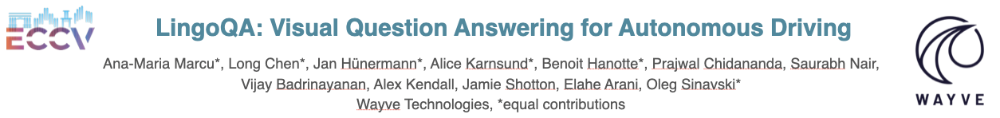

Official GitHub repository for "LingoQA: Video Question Answering for Autonomous Driving", presenting the LingoQA benchmark, dataset and baseline model for autonomous driving Video Question Answering (VQA). 


# LingoQA: Video Question Answering for Autonomous Driving
>
>Ana-Maria Marcu, Long Chen, Jan Hünermann, Alice Karnsund, Benoit Hanotte, Prajwal Chidananda, Saurabh Nair, Vijay Badrinarayanan, Alex Kendall, Jamie Shotton, Oleg Sinavski
>
>[[preprint]](https://github.com/wayveai/LingoQA/blob/main/assets/preprint.pdf)[[arxiv]](https://arxiv.org/abs/2312.14115)


## Overview <a name="overview"></a> 

In this repository you will find:
- A summary of the LingoQA dataset and evaluation metric
- An example of how to run the benchmark on your model predictions
- Details about how to download the datasets
- An example of how to run the novel evaluation metric, Lingo-Judge

## 3-minute summary <a name="summary"></a> 

[](https://www.canva.com/design/DAF-vlMT8vo/X7ynk_nv52t7jE7UpKlRBg/watch?utm_content=DAF-vlMT8vo&utm_campaign=designshare&utm_medium=link&utm_source=editor)

## Benchmark
To run the LingoQA benchmark on your predictions, simply install the requirements for the repository:

```
pip install -r ./requirements.txt
```

Export the predictions of your model to a .csv file and then run them as such:

```
python ./benchmark/evaluate.py --predictions_path ./path_to_predictions/predictions.csv
```

## Download Data and Annotations <a name="dataset"></a> 
The LingoQA training and evaluation datasets contain:
- Videos corresponding to driving scenarios
- Language annotations

| Datset                    | Split  | Videos | QA Pairs | QA Per Scenario |            Link         |
|---------------------------|--------|--------|----------|-----------------|-------------------------|
| Scenery                   | Train  |  3.5k  |  267.8k  |     ~10.9       |   https://drive.google.com/drive/folders/1ivYF2AYHxDQkX5h7-vo7AUDNkKuQz_fL/scenery   |
| Action                    | Train  | 24.5k  |  152.5k  |     ~43.6       |   https://drive.google.com/drive/folders/1ivYF2AYHxDQkX5h7-vo7AUDNkKuQz_fL/action   |
| Evaluation                | Test   |   100  |   1000   |       10        |   https://drive.google.com/drive/folders/1ivYF2AYHxDQkX5h7-vo7AUDNkKuQz_fL/evaluation   |


## Evaluation Metric <a name="dataset"></a> 

Lingo-Judge is an evaluation metric that aligns closely with human judgement on the LingoQA evaluation suite. 

```
# Import necessary libraries
from transformers import pipeline

# Define the model name to be used in the pipeline
model_name = 'wayveai/Lingo-Judge'

# Define the question and its corresponding answer and prediction
question = "Are there any pedestrians crossing the road? If yes, how many?"
answer = "1"
prediction = "Yes, there is one"

# Initialize the pipeline with the specified model, device, and other parameters
pipe = pipeline("text-classification", model=model_name)
# Format the input string with the question, answer, and prediction
input = f"[CLS]\nQuestion: {question}\nAnswer: {answer}\nStudent: {prediction}"

# Pass the input through the pipeline to get the result
result = pipe(input)

# Print the result and score
score = result[0]['score']
print(score > 0.5, score)

```

## Citation <a name="citation"></a> 

If you find our work useful in your research, please consider citing:

```bibtex
@article{marcu2023lingoqa,
  title={LingoQA: Video Question Answering for Autonomous Driving}, 
  author={Ana-Maria Marcu and Long Chen and Jan Hünermann and Alice Karnsund and Benoit Hanotte and Prajwal Chidananda and Saurabh Nair and Vijay Badrinarayanan and Alex Kendall and Jamie Shotton and Oleg Sinavski},
  journal={arXiv preprint arXiv:2312.14115},
  year={2023},
}
```